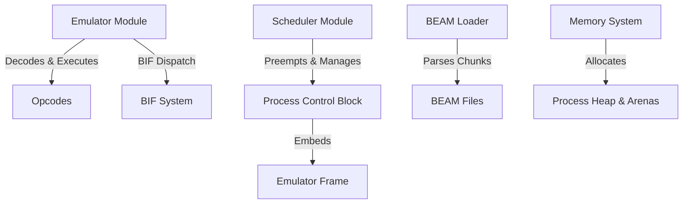

# Architecture & Knowledge Graph

**Last Commit**: `be3a02694e7a5e76a1f0934fb9fbbdd559b06498`  
**Supported Opcodes**: 34  

## Component Dependency Graph

## Supported Opcodes List

- `BEAM_OP_LABEL`
- `BEAM_OP_MOVE`
- `BEAM_OP_ADD`
- `BEAM_OP_SUB`
- `BEAM_OP_MUL`
- `BEAM_OP_INT_DIV`
- `BEAM_OP_ALLOCATE`
- `BEAM_OP_DEALLOCATE`
- `BEAM_OP_CALL`
- `BEAM_OP_RETURN`
- `BEAM_OP_SEND`
- `BEAM_OP_RECEIVE`
- `BEAM_OP_MATCH_TUPLE`
- `BEAM_OP_GET_TUPLE_ELEMENT`
- `BEAM_OP_TEST_IS_EQ_EXACT`
- `BEAM_OP_TEST_IS_NE_EXACT`
- `BEAM_OP_TEST_IS_TUPLE`
- `BEAM_OP_TEST_IS_LIST`
- `BEAM_OP_GET_LIST`
- `BEAM_OP_SELECT_VAL`
- `BEAM_OP_CALL_EXT`
- `BEAM_OP_CALL_LAST`
- `BEAM_OP_MAKE_FUN2`
- `BEAM_OP_LOOP_REC`
- `BEAM_OP_LOOP_REC_END`
- `BEAM_OP_REMOVE_MESSAGE`
- `BEAM_OP_WAIT`
- `BEAM_OP_TRY`
- `BEAM_OP_TRY_CASE`
- `BEAM_OP_CATCH`
- `BEAM_OP_TRY_END`
- `BEAM_OP_RAISE`
- `BEAM_OP_TRY_CASE_END`
- `BEAM_OP_HALT`
